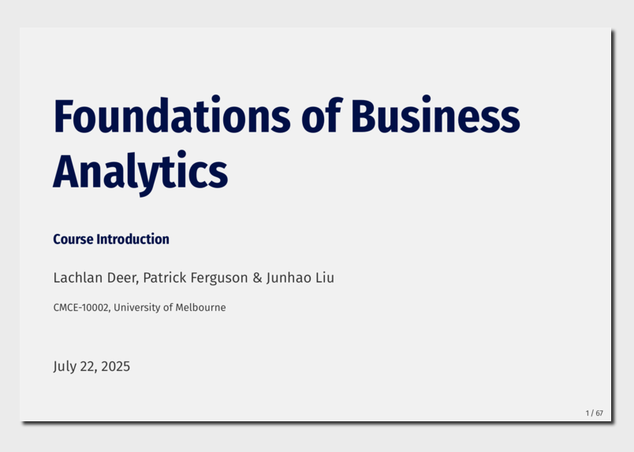

<!-- README.md is generated from README.qmd. Please edit that file -->

# Foundations of Business Analytics: Course Introduction

[]()
[]()
[](https://creativecommons.org/licenses/by-sa/4.0/)

## Meta-Information

- Module Maintainer: Lachlan Deer (`@lachlandeer`) & Patrick Ferguson
  (`@pjferg`)
- Course: [Foundations of Business
  Analytics](https://unimelb-cmce-10002.github.io/fba-book/)
- Institute: Faculty of Business & Economics, University of Melbourne
- Current Version: [2025
  edition](https://handbook.unimelb.edu.au/2025/subjects/cmce10002)

[](out/presentation.pdf)

## Introduction

Slides for the Lecture 1 of Foundations of Business Analytics

## Suggested Citation (for the Module)

Deer, L., Ferguson, P.J and Liu, J. (2025) Foundations of Business
Analytics: Course Introduction.
https://github.com/unimelb-cmce-10002/fba-lecture-course-intro

``` out
@misc{fba2025_l01,
      title={"Digital and Social Media Strategies: Course Introduction"},
      author={Lachlan Deer, Patrick Ferguson and Junhao Liu},
      year={2025,
      url = "https://github.com/unimelb-cmce-10002/fba-lecture-course-intro"
}
```
